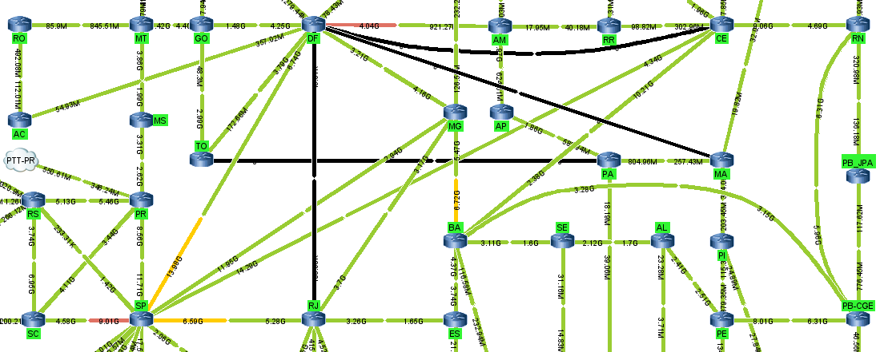

# Grafos2_TopologiaRedesBrasil

**Conteúdo da Disciplina**: Grafos 2<br>

## Alunos
|Matrícula | Aluno 
| -- | -- | 
| 18/0018159  |  Guilherme Veríssimo Cerveira Braz | 
| 18/0108344  |  Rafael Berto Pereira | 

## Sobre 
Usar Dijkstra em python para verificar o melhor caminho da topologia do [site](https://www.rnp.br/sistema-rnp/ferramentas/panorama-de-trafego)

## Screenshots
Nosso trabalho irá se basear nesse grafo de panorama de tráfego para gerar o melhor caminho a partir de Dijkstra




## Video
Está disponibilizado na pasta video na extensão ".mp4"

## Instalação 
use o comando: pip install -r requirements.txt

**Linguagem**: Python3 <br>
**Bibliotecas**: declaradas no requirements.txt<br>
**Pre-Requisitos**: Python 3.10.4 <br>

## Uso 
* Entre na pasta do script:

```sh
cd ../Grafos2_TopologiaRedesBrasil/source 
```

* Rode o projeto com o comando:

```sh
python3 script.py 
```


